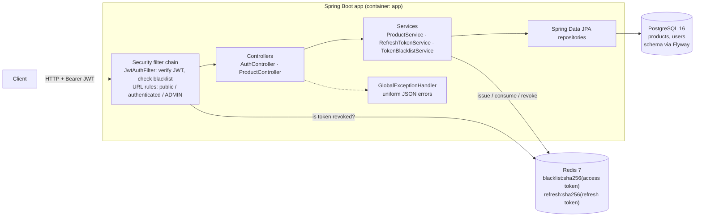
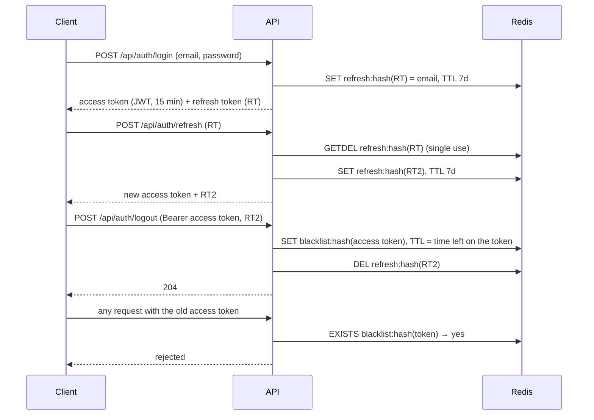

# Store API

[](https://github.com/ahmedfathi-code/store-api/actions/workflows/ci.yml)

A Spring Boot REST API for a product catalog. It has JWT authentication with refresh-token rotation and real logout, ADMIN/USER roles, and paginated, sortable product listing. It runs on PostgreSQL (schema managed by Flyway) and Redis, and starts with a single `docker compose up`.

## Problem

A store backend needs more than CRUD:

- **Only staff may change the catalog.** Anyone can browse; only admins create, update or delete products.
- **Catalogs are large.** Clients need pages, a page size and a sort order, and must not be able to pull the whole table in one request.
- **Logout has to mean logout.** A stateless JWT stays valid until it expires. If a token leaks, or a user logs out, the server needs a way to reject it early.
- **The schema has to be reproducible.** Every environment, from a laptop to CI to production, should build the same database from versioned migrations, not from whatever an ORM guessed.
- **It has to be easy to run.** A reviewer should be able to start the whole stack with one command.

This project covers all five.

## Architecture



**Token lifecycle:**



## Tech stack

Java 21 · Spring Boot 4 (Web MVC, Security, Data JPA, Data Redis, Validation, Actuator) · JJWT · springdoc-openapi (Swagger UI) · PostgreSQL 16 · Flyway · Redis 7 · JUnit 5, Mockito, Testcontainers · Docker, Docker Compose · GitHub Actions

## How to run

### With Docker (recommended)

You only need Docker.

```bash
cp .env.example .env
# edit .env: set DB_USERNAME, DB_PASSWORD and JWT_SECRET (at least 32 characters)
# optional: ADMIN_EMAIL and ADMIN_PASSWORD to get an admin account (see "Creating an admin")
docker compose up --build
```

- API: `http://localhost:8080` (change the host port with `APP_PORT`)
- **Swagger UI: `http://localhost:8080/swagger-ui.html`** (OpenAPI spec at `/v3/api-docs`)
- Health: `http://localhost:8080/actuator/health`

Compose starts PostgreSQL and Redis first, waits until both are healthy, then starts the app. Flyway creates the schema on first start. Data is kept in the `postgres-data` volume; `docker compose down -v` deletes it. If a required variable is missing, compose stops immediately and names it.

### Without Docker

Requires Java 21 and a running PostgreSQL and Redis. Set the variables below (see `.env.example`), then:

```bash
./mvnw spring-boot:run
```

### Environment variables

| Variable | Required | Default | Purpose |
|---|---|---|---|
| `DB_USERNAME`, `DB_PASSWORD` | yes | none | PostgreSQL credentials |
| `JWT_SECRET` | yes | none | HMAC key for signing JWTs, at least 32 characters |
| `DB_URL` | no | `jdbc:postgresql://localhost:5432/product_store_db` | JDBC URL (compose sets this itself) |
| `REDIS_HOST`, `REDIS_PORT`, `REDIS_PASSWORD` | no | `localhost`, `6379`, empty | Redis connection (compose sets this itself) |
| `JWT_ACCESS_TOKEN_EXPIRATION` | no | `15m` | Access-token lifetime |
| `JWT_REFRESH_TOKEN_EXPIRATION` | no | `7d` | Refresh-token lifetime |
| `ADMIN_EMAIL`, `ADMIN_PASSWORD` | no | empty | Create this ADMIN on startup if it doesn't exist (set both; password 12+ characters) |
| `OPENAPI_ENABLED` | no | `true` | Serve the OpenAPI spec and Swagger UI; `false` removes both |
| `SHOW_SQL` | no | `false` | Log every SQL statement (local debugging) |
| `RATE_LIMIT_WINDOW` | no | `15m` | Window for counting failed password attempts |
| `RATE_LIMIT_LOGIN_PER_ACCOUNT` | no | `5` | Failed logins allowed per client IP + email per window |
| `RATE_LIMIT_LOGIN_PER_IP` | no | `30` | Failed logins allowed per client IP (any email) per window |
| `RATE_LIMIT_CHANGE_PASSWORD` | no | `5` | Wrong current passwords allowed per user per window |
| `APP_PORT` | no | `8080` | Host port (docker compose only) |

### Creating an admin

`/api/auth/register` always creates a `ROLE_USER` account. To get an admin, set both of these in `.env` before starting:

```bash
ADMIN_EMAIL=admin@example.com
ADMIN_PASSWORD=choose-a-long-password   # at least 12 characters
```

On startup the app creates that account as `ROLE_ADMIN` if it doesn't exist yet, then you log in with it as usual. The seed only ever creates:

- restarting never duplicates the account;
- changing `ADMIN_PASSWORD` later does not change an existing admin's password;
- an email that already belongs to a USER is **not** promoted (a warning is logged).

If only one of the two is set, the email is invalid, or the password is shorter than 12 characters, the app refuses to start and says why.

To promote an existing user instead, update the row directly:

```bash
docker compose exec postgres sh -c 'psql -U "$POSTGRES_USER" -d "$POSTGRES_DB" -c "update users set role = '"'"'ROLE_ADMIN'"'"' where email = '"'"'someone@example.com'"'"';"'
```

Then log in again to get a token with the new role.

### Running the tests

```bash
./mvnw verify            # unit + integration tests (Docker must be running)
./mvnw verify -DskipITs  # unit tests only, no Docker needed
```

## API

The interactive docs at **`/swagger-ui.html`** list every endpoint with its parameters, limits and responses. To call protected endpoints from there, log in via `POST /api/auth/login`, click **Authorize** and paste the access token. The lock icons mark the operations that need one.

| Method | Path | Access | Description |
|---|---|---|---|
| `POST` | `/api/auth/register` | public | Create a USER account |
| `POST` | `/api/auth/login` | public | Get an access token and a refresh token (`429` after too many failures) |
| `POST` | `/api/auth/refresh` | public (needs a refresh token) | Exchange a refresh token for a new pair |
| `POST` | `/api/auth/logout` | authenticated | Revoke the access token, and the refresh token if sent |
| `POST` | `/api/auth/change-password` | authenticated | Change your password (needs the current one); logs out every other session and returns a new token pair |
| `GET` | `/api/products` | public | Paginated, sortable list |
| `GET` | `/api/products/{id}` | public | One product |
| `GET` | `/api/products/search/name?name=` | public | Paginated, case-insensitive "contains" search |
| `GET` | `/api/products/search/category?category=` | public | Paginated, case-insensitive exact category match |
| `POST` | `/api/products` | **ADMIN** | Create a product |
| `PUT` | `/api/products/{id}` | **ADMIN** | Replace a product |
| `DELETE` | `/api/products/{id}` | **ADMIN** | Delete a product |
| `GET` | `/actuator/health` | public | `{"status":"UP"}`, or `DOWN` if the database or Redis is unreachable |
| `GET` | `/swagger-ui.html`, `/v3/api-docs` | public | Swagger UI and the OpenAPI 3.1 spec (off with `OPENAPI_ENABLED=false`) |

Every product endpoint returns the same shape: `{"id", "name", "price", "category", "stock"}` (inside `content` for paginated results).

### Languages

Messages are in English by default. Send `Accept-Language: ar` to get them in Arabic; any other language falls back to English.

```bash
curl -H 'Accept-Language: ar' localhost:8080/api/products/999
# 404 {"status":404,"message":"المنتج مش موجود بالـ id ده: 999",...}
```

### Pagination

`GET /api/products` accepts:

| Param | Default | Rules |
|---|---|---|
| `page` | `0` | 0 or greater |
| `size` | `10` | 1 to 100 |
| `sortBy` | `id` | a product field: `id`, `name`, `price`, `category`, `stock` |
| `direction` | `asc` | `asc` or `desc`, case-insensitive |

The search endpoints accept `page` and `size` with the same rules. Any invalid value returns `400` with a message.

## Request examples

These are real responses from the Docker stack. Tokens are shortened, and the page response is pretty-printed with its `pageable` and `sort` metadata collapsed.

**Register and log in**

```bash
curl -X POST localhost:8080/api/auth/register \
  -H 'Content-Type: application/json' \
  -d '{"email":"admin@example.com","password":"Passw0rd!"}'
# 201 {"message":"Registered successfully"}
# with -H 'Accept-Language: ar':  201 {"message":"تم التسجيل بنجاح"}

curl -X POST localhost:8080/api/auth/login \
  -H 'Content-Type: application/json' \
  -d '{"email":"admin@example.com","password":"Passw0rd!"}'
# 200 {"token":"eyJhbGciOiJI...","refreshToken":"blFSeywM...","expiresIn":900}
```

**Create a product (ADMIN)**

```bash
curl -X POST localhost:8080/api/products \
  -H "Authorization: Bearer $TOKEN" -H 'Content-Type: application/json' \
  -d '{"name":"Desk Lamp","price":24.0,"category":"office","stock":15}'
# 201 {"id":4,"name":"Desk Lamp","price":24.0,"category":"office","stock":15}
```

The same request with a USER's token returns `403 {"status":403,"message":"Access denied",...}`. Without a token it returns `401` (see **Errors** below).

**List: page 0, 2 per page, most expensive first**

```bash
curl 'localhost:8080/api/products?page=0&size=2&sortBy=price&direction=desc'
```

```json
{
  "content": [
    {"id": 4, "name": "Desk Lamp", "price": 24.0, "category": "office", "stock": 15},
    {"id": 3, "name": "Coffee Mug", "price": 7.9, "category": "kitchen", "stock": 40}
  ],
  "number": 0,
  "size": 2,
  "numberOfElements": 2,
  "totalElements": 4,
  "totalPages": 2,
  "first": true,
  "last": false,
  "empty": false,
  "pageable": { "...": "..." },
  "sort": { "...": "..." }
}
```

**Search by category**

```bash
curl 'localhost:8080/api/products/search/category?category=office&size=2'
# 200 {"content":[{"id":1,"name":"Notebook",...},{"id":2,"name":"Pen",...}],"totalElements":3,...}
```

**Refresh, then log out**

```bash
curl -X POST localhost:8080/api/auth/refresh \
  -H 'Content-Type: application/json' -d "{\"refreshToken\":\"$REFRESH\"}"
# 200 {"token":"eyJhbGciOiJI...","refreshToken":"fmsdNZLG...","expiresIn":900}

# the same refresh token a second time (they are single use)
# 401 {"message":"Invalid or expired refresh token"}

curl -X POST localhost:8080/api/auth/logout \
  -H "Authorization: Bearer $NEW_TOKEN" -H 'Content-Type: application/json' \
  -d "{\"refreshToken\":\"$NEW_REFRESH\"}"
# 204, after which $NEW_TOKEN is rejected (401 invalid_token) and $NEW_REFRESH returns 401
```

**Errors**

Errors share one JSON shape:

```bash
curl 'localhost:8080/api/products?size=500'
# 400 {"status":400,"message":"size must be at most 100","timestamp":"2026-09-28T00:14:22.763470682"}

curl localhost:8080/api/products/999
# 404 {"status":404,"message":"Product not found with id: 999","timestamp":"2026-09-28T00:14:22.809429402"}
```

Authentication failures follow RFC 6750: `401` with a `WWW-Authenticate` header when the caller isn't authenticated, and `403` only when an authenticated caller lacks the role.

```bash
curl -i -X POST localhost:8080/api/products -H 'Content-Type: application/json' -d '{...}'
# 401  WWW-Authenticate: Bearer
# {"status":401,"message":"Authentication required","timestamp":"2026-09-28T10:29:12.584318848"}

curl -i -X POST localhost:8080/api/products -H "Authorization: Bearer $REVOKED_OR_BAD_TOKEN" ...
# 401  WWW-Authenticate: Bearer error="invalid_token"
# {"status":401,"message":"Invalid, expired or revoked token","timestamp":"2026-09-28T10:29:13.107506412"}

curl -i -X POST localhost:8080/api/products -H "Authorization: Bearer $USER_TOKEN" ...
# 403
# {"status":403,"message":"Access denied","timestamp":"2026-09-28T10:29:35.523143309"}
```

## Design decisions

**Flyway owns the schema; Hibernate only validates it.**
`V1__init.sql` was generated from Hibernate's own DDL, not written by hand, so existing databases match it exactly. With `ddl-auto=validate` the app refuses to start if the entities and the schema drift apart.
*Trade-off:* every entity change needs a migration.

**Short access tokens, rotating opaque refresh tokens.**
Access tokens are JWTs that live 15 minutes, each with a random `jti`, so two sessions that log in within the same second still get different tokens and log out independently. Refresh tokens are random 256-bit strings, not JWTs, stored in Redis for 7 days. Each refresh token works once: `GETDEL` makes consuming it atomic.

**A replayed refresh token logs the user out everywhere.**
A consumed refresh token is remembered (`refresh-used:<hash>`, 7 days), and the delete and the "used" marker happen atomically in one Lua script. If a token that was already used is presented again, someone else must have it: every session of that user is revoked (the thief's freshly issued tokens included), a warning is logged, and the caller gets the same `401` as for any invalid token. The real user logs in again and is back in control. Tokens deleted by logout, or never issued, are just invalid and don't trigger it.
*Trade-offs:* all of the user's sessions are revoked, not just the one login "family", which reuses the password-change mechanism at no per-request cost. There's no grace period: a client that retries a refresh with the same token (e.g. after a timeout) is treated as a replay. **Clients should retry refresh only with the newest refresh token.**
*Why:* a refresh token has to be revocable, which means server-side state anyway, so a signed JWT would add nothing.
*Trade-off:* clients must refresh every 15 minutes.

**Failed password attempts are rate-limited.**
Wrong passwords are counted in fixed 15-minute windows in Redis: 5 per client IP + email and 30 per client IP on login, and 5 per user on change-password. Once a limit is reached the endpoint answers `429` with `Retry-After`, **before** checking the password, so guessing stops even when the next guess would be right. Only failures count, and a success resets that account's counter, so normal users never notice. Keying on IP + email (not the email alone) means an attacker can't lock a victim out from somewhere else. The IP-wide limit catches one machine trying many accounts.
*Deployment note:* the client IP is the TCP peer address; `X-Forwarded-For` isn't trusted, because anyone can send it to get a fresh counter. Behind Docker's port publishing or a reverse proxy, every client can appear as the same address, which makes the per-IP limit shared. In production, put the app behind a proxy and set `server.forward-headers-strategy` so the real client IP is used.

**A password change logs out every session.**
Changing a password stores a per-user "valid after" timestamp in Redis. Every access or refresh token issued before it is rejected, so a stolen token stops working as soon as the victim changes their password. The caller gets a fresh token pair in the same response. Tokens carry a millisecond issue time (`iatMs`) for this comparison, because the JWT `iat` is only in seconds. The marker expires with the longest token lifetime (7 days), after which no older token can exist.
*Trade-off:* one extra Redis `GET` per authenticated request. New passwords must be at least 6 characters for USERs and 12 for ADMINs (the same as registration and the admin seed).

**Logout blacklists the access token until it would expire anyway.**
The Redis key's TTL is the token's remaining lifetime, so the blacklist cleans itself up and never grows beyond the currently valid tokens. Checking it costs one `EXISTS` per authenticated request.

**Only hashes go into Redis.**
Keys are `sha256(token)`, so a Redis dump can't be replayed as credentials.

**Fail closed when Redis is down.**
Requests carrying a token, plus login and refresh, return `503` within 2 seconds rather than skipping the blacklist check. Skipping it would silently make logged-out tokens valid again. Anonymous reads keep working.

**The admin seed only creates.**
An account is created from `ADMIN_EMAIL`/`ADMIN_PASSWORD` only when none exists with that email. It never promotes an existing user, because an environment variable shouldn't be able to silently turn someone's account into an admin, and it never overwrites a password someone may have changed on purpose. Misconfiguration stops the app at startup rather than leaving it running without the expected admin.
*Trade-off:* the env var can't rotate the admin password; the admin changes it with `POST /api/auth/change-password` like any user.

**Role rules live in one place.**
All access rules are URL rules in `SecurityConfig`, not scattered `@PreAuthorize` annotations. Writes to `/api/products/**` need `ROLE_ADMIN`.

**`401` means "who are you?", `403` means "not allowed".**
Missing, malformed, forged, expired and revoked tokens all get `401` with an RFC 6750 `WWW-Authenticate: Bearer` challenge (`error="invalid_token"` when a token was sent), so clients know to log in or refresh. `403` is reserved for authenticated users without the required role. Both use the same JSON error body as every other error, written from the security filter chain where `@RestControllerAdvice` can't reach.
*Trade-off:* this changed the earlier behaviour (a bare `403` for everything). Contract changes like this were made only in a dedicated milestone and listed in its PR.

**One product shape, never the entity.**
Every product endpoint returns `ProductResponseDto`, so the JPA entity is never serialised to clients and a new column can't leak into responses by accident.

**Messages in English or Arabic.**
All client-facing messages live in `messages.properties` and `messages_ar.properties`, chosen by `Accept-Language`, with English as the fallback and never the server's OS locale. Validation annotations reference keys, and errors raised in the security filter chain resolve the language themselves, because Spring MVC hasn't set it yet at that point. Ids are passed as text so they aren't formatted as `999,999`.

**Input errors are `400`, not `500`.**
Bad paging values, unknown sort fields, non-numeric ids and malformed JSON return `400`. The catch-all exception handler passes through Spring MVC's own status codes (`404`, `405`, `415`), and genuinely unexpected errors are logged and returned as `500`.

**Testcontainers instead of an in-memory database.**
Integration tests run against real PostgreSQL and Redis, so they exercise the real Flyway migration, `ddl-auto=validate` and real token revocation. H2 compatibility mode can't prove any of that.
*Trade-off:* `./mvnw verify` needs Docker.

**Layered, non-root Docker image.**
The multi-stage build caches dependencies in their own layer and splits the jar into Spring Boot layers, so a code change rebuilds only the small application layer. The container runs as an unprivileged user, with the heap sized from the container's memory limit.

**Health only, without details.**
Actuator exposes just `/actuator/health`, publicly and without component details, so compose can wait for a truly ready app without revealing anything about the database or Redis.

**API docs generated from the code.**
springdoc builds the OpenAPI spec from the controllers, so it can't drift from the implementation. Validation rules appear as limits (`size` 1–100, `direction` `asc|desc`), and a test checks that the lock icons sit on exactly the operations `SecurityConfig` protects. The docs are public by default for this portfolio project.
*Trade-off:* public docs also map the API's surface for anyone probing it, so a production deployment can turn them off with `OPENAPI_ENABLED=false`.

## Testing

| Suite | Tests | What it covers |
|---|---|---|
| Unit (Mockito) | 57 | `ProductService` (sort and page building, DTO mapping incl. search, not-found paths), `UserDetailsServiceImpl` (roles to authorities), `JwtUtil` (unique tokens per login, millisecond issue time, round trip, wrong key), `RefreshTokenService` and `TokenBlacklistService` (hashing, TTLs, single-use consumption with valid/reused/unknown outcomes, stored issue time incl. old format), `SessionRevocationService` (valid-after marker), `LoginAttemptService` (counting, window, block, Retry-After, reset), `AdminSeeder` (create, never promote or overwrite, startup validation) |
| `ProductPaginationIT` | 20 | defaults, page and size, totals, sorting by price and name in both directions, sorting across pages, search paging, size limit, `400`s (including unsafe `sortBy` values) and `404` |
| `ProductSecurityIT` | 18 | every product endpoint returns the same five fields; USER gets `403` (JSON, no challenge) on writes, including unmapped methods, and nothing changes; ADMIN gets `201`/`200`/`204`; no token, malformed, forged and deleted-user tokens get `401` with the right `WWW-Authenticate`; public reads |
| `AdminSeedIT` | 2 | the seeded admin exists after startup, can log in and create products; re-running changes nothing |
| `PasswordChangeIT` | 9 | change revokes every earlier access and refresh token (other devices too) while the returned tokens work; old password refused; wrong current, unchanged and too-short (6 USER / 12 ADMIN) are `400`; wrong current passwords are rate-limited (`429`); `401` without a token; Arabic messages |
| `RateLimitIT` | 6 | 6th login attempt is `429` even with the right password; `Retry-After` within the window; another IP unaffected; success resets; IP blocked after 30 failures across accounts; Arabic message |
| `RefreshReuseIT` | 4 | replaying a used refresh token revokes the thief's new tokens and every other session while a fresh login works; logged-out or unknown tokens revoke nothing; the used-marker is hashed with a 7-day TTL |
| `AuthTokensIT` | 10 | register, login, refresh rotation, reuse rejected, logout revokes both tokens, logging out one session leaves another working, blacklist TTL, only hashes stored |
| `ErrorHandlingIT` | 5 | `404`, `405`, `415`, malformed JSON gives `400` |
| `HealthEndpointIT` | 3 | public `UP` without details; other Actuator endpoints not exposed |
| `OpenApiIT` | 6 | spec and Swagger UI are public; every endpoint listed; bearer scheme; lock on exactly the protected operations; paging limits documented |
| `OpenApiDisabledIT` | 1 | with the docs turned off, the spec and UI return `404` |
| `MessagesI18nIT` | 7 | every message source (controllers, validation, handler, security filter) in English and Arabic; unsupported or missing language falls back to English |
| `ProductStoreApplicationIT` | 1 | context starts on a fresh database and Flyway applied V1 |

CI runs `./mvnw verify` on every push and pull request to `main`. A parallel job validates `docker-compose.yml` and builds the image.

## Project structure

```
src/main/java/com/springtest/product_store/
├── config/       OpenApiConfig, AdminSeeder
├── controller/   AuthController, ProductController
├── dto/          request/response DTOs, ErrorResponse
├── entity/       Product, User (JPA)
├── exception/    GlobalExceptionHandler, custom exceptions
├── model/        Role
├── repository/   Spring Data JPA repositories
├── security/     SecurityConfig, JwtAuthFilter, JwtUtil,
│                 RefreshTokenService, TokenBlacklistService, TokenHasher
└── service/      ProductService
src/main/resources/db/migration/   Flyway migrations
src/test/java/...                   *Test (unit), *IT (Testcontainers)
Dockerfile · docker-compose.yml · .github/workflows/ci.yml
```

## Known limitations and next steps

- **No password reset ("forgot password").** Changing a password needs the current one; a reset flow needs email delivery, which the project doesn't have.
